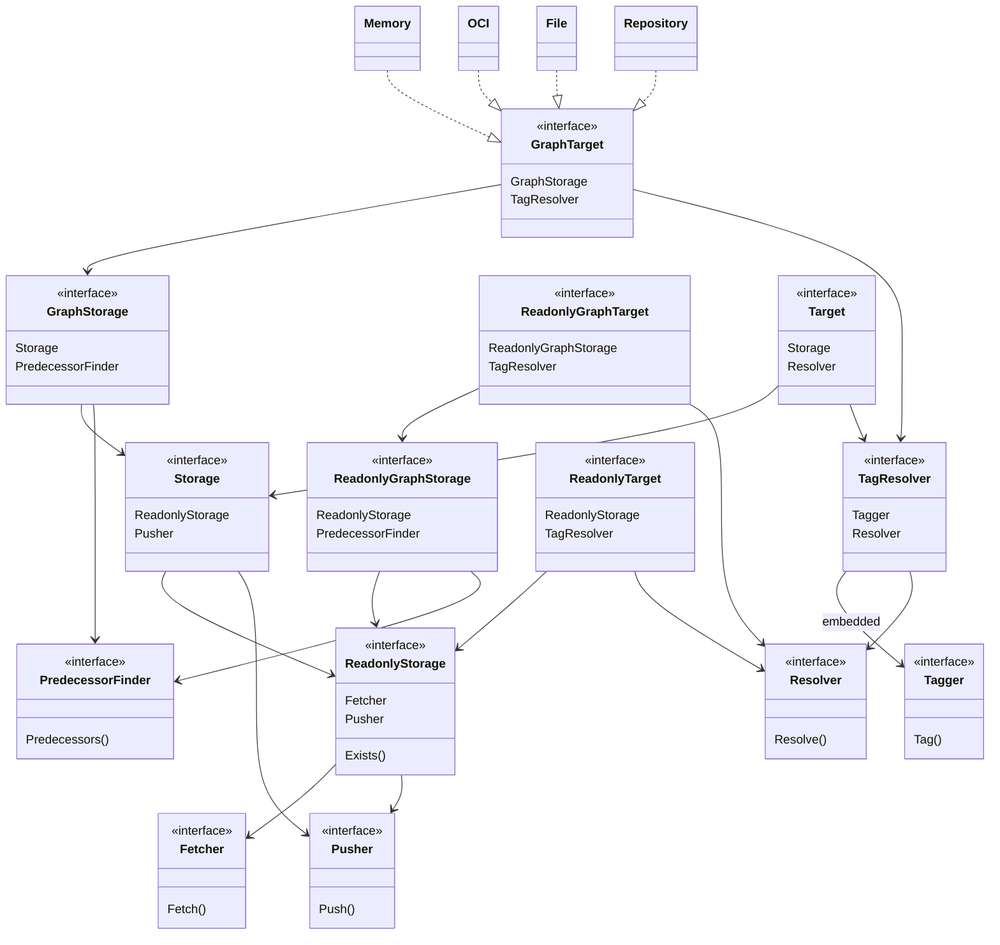

# Architecture

- test
    - sub 

- Target interfaces
    - Target (Storage + TagResolver)
    - GraphTarget (Target + PredecessorFinder)
    - ReadonlyTarget
    - ReadonlyGraphTarget

- Storage Interfaces (CAS)
    - Fetch
    - Exist
    - Push

- TagResolver Interfaces
    - Resolve
    - Tag

- Content Stores
    - File
    - OCI
    - Memory
    - Repository

- Top-level methods
    - Copy
    - Extended Copy
    - Pack, Resolve, etc. (omit)

